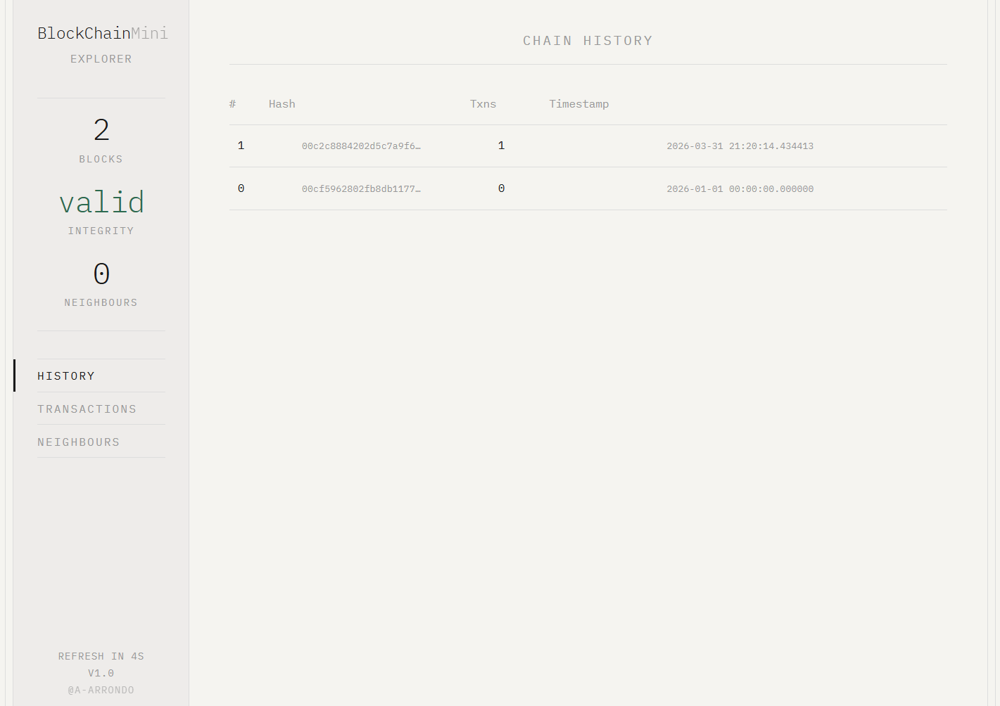
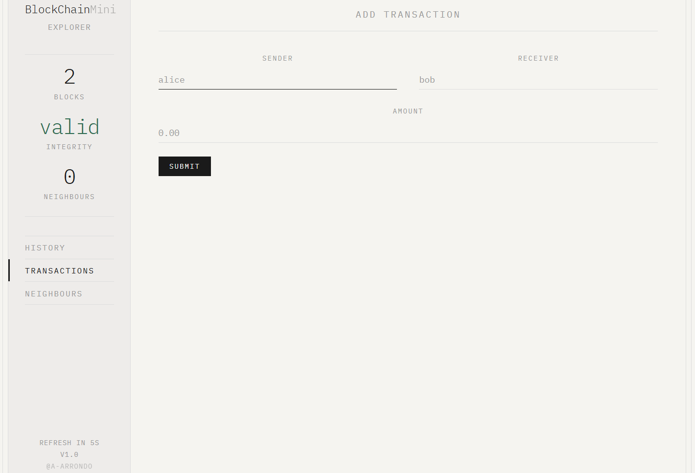
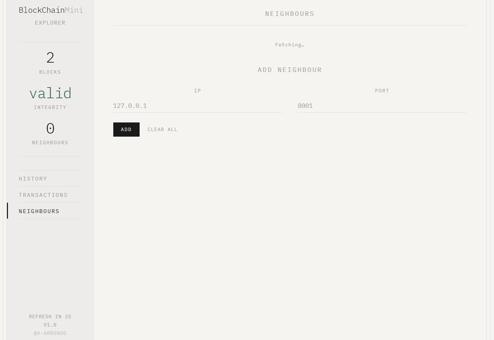

# BlockChainMini
A minimal blockchain implementation built from scratch in Python, with a React explorer frontend. Designed for learning purposes.

## Objective
This project illustrates the core mechanics of a blockchain: transaction handling, proof-of-work mining, and multi-node consensus. It is not intended for production use.

## Requirements

**Backend**
- Python 3.13+
- [uv](https://github.com/astral-sh/uv)

**Frontend**
- Node.js 18+
- npm

## Setup

Clone the repository:
```bash
git clone <repo-url>
cd BlockChainMini
```

Install backend dependencies:
```bash
uv sync
```

Install frontend dependencies:
```bash
cd frontend
npm install
```

## Running

Start the backend (defaults to port 8000):
```bash
uv run uvicorn main:app
```

Start the frontend:
```bash
cd frontend
npm run dev
```

Open `http://localhost:5173` in your browser. The frontend proxies all `/blockchain` API calls to the backend automatically.

To run multiple nodes:
```bash
uv run uvicorn main:app --port 8001
uv run uvicorn main:app --port 8002
```
Then use the Neighbours tab in the explorer (or the `/blockchain/neighbours` endpoint directly) to connect nodes to each other.

## API overview
Once the backend is running, interactive API docs are available at `http://localhost:<port>/docs`.

| Endpoint | Method | Description |
|---|---|---|
| `/blockchain/status` | GET | Chain length and validity |
| `/blockchain/history` | GET | Full chain, length and validity |
| `/blockchain/append` | POST | Submit a new transaction |
| `/blockchain/neighbours` | GET / POST / DELETE | Manage peer nodes |
| `/blockchain/block` | POST | Receive a block from a peer (not intended to trigger manually) |

## Project structure
```
├── backend/
│   ├── main.py           # FastAPI routes
│   ├── service.py        # Business logic and async loops
│   ├── domain.py         # Domain classes (Blockchain, Block, Transaction...)
│   ├── schemas.py        # Pydantic models
│   └── config.py         # Configuration parameters
└── frontend/
    ├── src/
    │   ├── App.jsx       # All components and tab logic
    │   └── App.css       # Styles
    ├── index.html
    └── vite.config.js
```

## Screenshots
Here are some screenshots of the web-based explorer:
### Main page

### Add transactions

### Add neighbours

---

